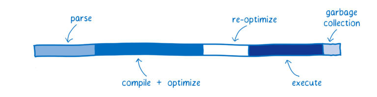
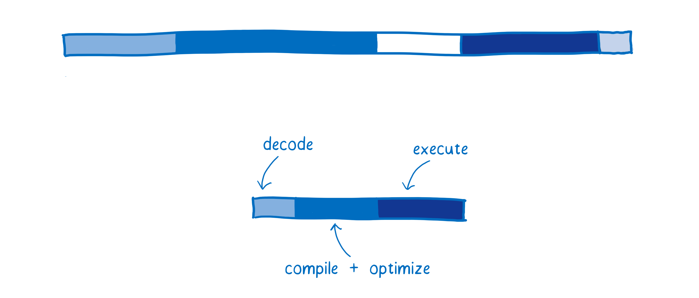
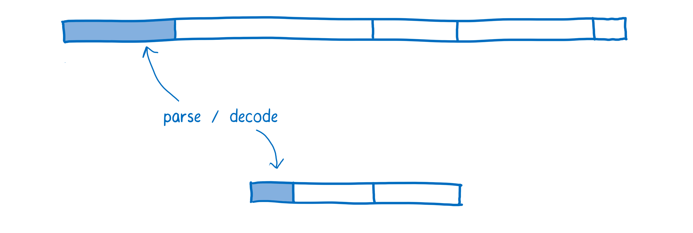
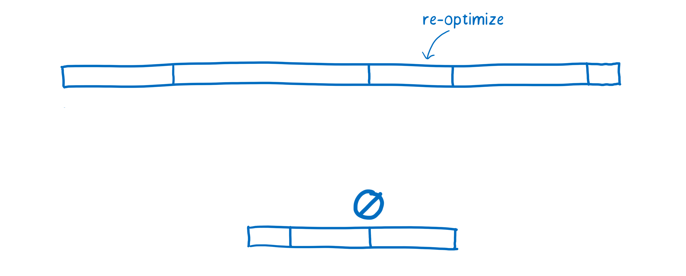
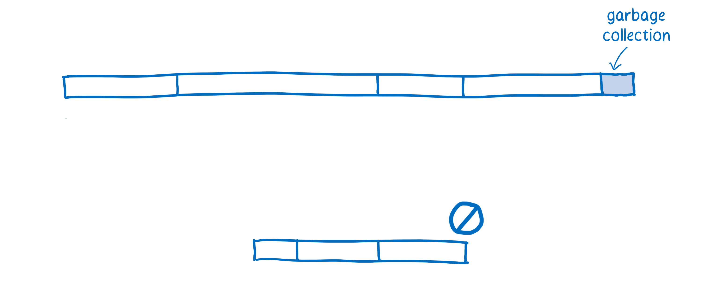

**WebAssembly**

NOTES:
_[1 minutes]_

=====

### **Features**


NOTES:
_[1 minutes]_

- Servers served static HTML content that browsers downloaded and rendered
- JavaScript was created in 1995 as a dynamic interpreted language
- It was slow
- As the web became more popular performance became an issue
- Browsers started implementing JIT compilers to improve performance
- Today JavaScript is run on platforms other than the browser.
    * V8 in Chrone and Node.js
    * SpiderMonkey in Firefox
    * Chakra in Edge
    * JavaScriptCore in Safari
    * Nashorn, Rhino for Java, etc...

=====

### **JavaScript**

<br />


NOTES:
_[2 minutes]_

Each bar shows the time spent doing a particular task.

Parsing — the time it takes to process the source code into something that the interpreter can run.

Compiling + optimizing — the time that is spent in the baseline compiler and optimizing compiler. Some of the optimizing compiler’s work is not on the main thread, so it is not included here.

Re-optimizing — the time the JIT spends readjusting when its assumptions have failed, both re-optimizing code and bailing out of optimized code back to the baseline code.

Execution — the time it takes to run the code.

Garbage collection — the time spent cleaning up memory.

One important thing to note: these tasks don’t happen in discrete chunks or in a particular sequence. Instead, they will be interleaved. A little bit of parsing will happen, then some execution, then some compiling, then some more parsing, then some more execution, etc.

### **"Limitations"**

* Parsing necessary to transform human readable code to AST and then VM bytecode.
* Constant optimization (with discard, deoptimization, & re-optimitize) process is difficult to efficiently in a dynamically typed language
* Garbage collection slows performance
* Forced to use JavaScript or a language that can compile to JavaScript

=====

### **WebAssembly**

* Not very web
* Not very assembly

=====

> WebAssembly is a new type of code that can be run in modern web browsers — it is a low-level assembly-like language with a compact binary format that runs with near-native performance and provides languages such as C/C++ with a compilation target so that they can run on the web. It is also designed to run alongside JavaScript, allowing both to work together.

NOTES:
_[1 minutes]_

=====

<br />


NOTES:
_[1 minutes]_

- Diagram is for LLVM compiler toolchain

=====

### **Languages**

- C, C++ (via Emscripten)
- Rust
- Go
- WebAssembly Text Format (wat)
- AssemblyScript (TypeScript -> WASM via Binaryen)
- Haskell (via Asterius WASM compiler, Alpha status)
- Others ?

NOTES:
_[1 minutes]_

=====

```
(module
 (export "fib" (func $fib))
 (func $fib (param $n i32) (result i32)
  (if
   (i32.lt_s
    (get_local $n)
    (i32.const 2)
   )
   (return
    (i32.const 1)
   )
  )
  (return
   (i32.add
    (call $fib
     (i32.sub
      (get_local $n)
      (i32.const 2)
     )
    )
    (call $fib
     (i32.sub
      (get_local $n)
      (i32.const 1)
     )
    )
   )
  )
 )
)
```

NOTES:
_[1 minutes]_

=====

### **Features**

* Compact binary format
* Near-native execution performance
* Executed in a structured stack machine / VM
* Memory-safe, sandboxed execution environment 
* Linear memory
* Build target
* Not a replacement for JavaScript

NOTES:
_[1 minutes]_

=====

### **Comparison**

<br />


NOTES:
_[1 minutes]_

 **Fetching** 

> Because WebAssembly is more compact than JavaScript, fetching it is faster.

Fetching WebAssembly takes less time because it is more compact than JavaScript, even when compressed.

=====

### **Parsing**

<br />


- No parsing, AST or bytecode involved
- Just needs to be decoded and validated to make sure there aren’t any errors in it

NOTES:
_[2 minutes]_

Once it reaches the browser, JavaScript source gets parsed into an Abstract Syntax Tree.

Browsers often do this lazily, only parsing what they really need to at first and just creating stubs for functions which haven’t been called yet.

From there, the AST is converted to an intermediate representation (called bytecode) that is specific to that JS engine.

In contrast, WebAssembly doesn’t need to go through this transformation because it is already an intermediate representation. It just needs to be decoded and validated to make sure there aren’t any errors in it.

=====

### **Compiling + optimizing**

<br />


NOTES:
_[2 minutes]_

- The compiler doesn’t have to spend time running the code to observe what types are being used before it starts compiling optimized code.
- The compiler doesn’t have to compile different versions of the same code based on those different types it observes.
- More optimizations have already been done ahead of time in LLVM. So less work is needed to compile and optimize it.

=====

### **Reoptimizing**

<br />


NOTES:
_[2 minutes]_

> Reoptimizing doesn’t need to happen because WebAssembly has types and other information built in, so the JS engine doesn’t need to speculate when it optimizes the way it does with JavaScript.

Sometimes the JIT has to throw out an optimized version of the code and retry it.

This happens when assumptions that the JIT makes based on running code turn out to be incorrect. For example, deoptimization happens when the variables coming into a loop are different than they were in previous iterations, or when a new function is inserted in the prototype chain.

There are two costs to deoptimization. First, it takes some time to bail out of the optimized code and go back to the baseline version. Second, if that function is still being called a lot, the JIT may decide to send it through the optimizing compiler again, so there’s the cost of compiling it a second time.

In WebAssembly, things like types are explicit, so the JIT doesn’t need to make assumptions about types based on data it gathers during runtime. This means it doesn’t have to go through reoptimization cycles.

=====

### **Executing**

<br />


NOTES:
_[2 minutes]_

> Executing often takes less time because there are fewer compiler tricks and gotchas that the developer needs to know to write consistently performant code, plus WebAssembly’s set of instructions are more ideal for machines.

It is possible to write JavaScript that executes performantly. To do it, you need to know about the optimizations that the JIT makes. For example, you need to know how to write code so that the compiler can type specialize it, as explained in the article on the JIT.

However, most developers don’t know about JIT internals. Even for those developers who do know about JIT internals, it can be hard to hit the sweet spot. Many coding patterns that people use to make their code more readable (such as abstracting common tasks into functions that work across types) get in the way of the compiler when it’s trying to optimize the code.

Plus, the optimizations a JIT uses are different between browsers, so coding to the internals of one browser can make your code less performant in another.

Because of this, executing code in WebAssembly is generally faster. Many of the optimizations that JITs make to JavaScript (such as type specialization) just aren’t necessary with WebAssembly.

In addition, WebAssembly was designed as a compiler target. This means it was designed for compilers to generate, and not for human programmers to write.

Since human programmers don’t need to program it directly, WebAssembly can provide a set of instructions that are more ideal for machines. Depending on what kind of work your code is doing, these instructions run anywhere from 10% to 800% faster.

=====

### **Garbage Collection**

<br />


NOTES:
_[2 minutes]_

> Garbage collection is not required since the memory is managed manually.

In JavaScript, the developer doesn’t have to worry about clearing out old variables from memory when they aren’t needed anymore. Instead, the JS engine does that automatically using something called a garbage collector.

This can be a problem if you want predictable performance, though. You don’t control when the garbage collector does its work, so it may come at an inconvenient time. Most browsers have gotten pretty good at scheduling it, but it’s still overhead that can get in the way of your code’s execution.

At least for now, WebAssembly does not support garbage collection at all. Memory is managed manually (as it is in languages like C and C++). While this can make programming more difficult for the developer, it does also make performance more consistent.

=====

### **WebAssembly Limitation**

- Calls between JavaScript and WebAssembly slow *
- No Web API access: DOM, CSSOM, WebGL, IndexedDB, Web Audio API
- No multi-threading / web workers
- Developer tooling and experience
- Modules integration

NOTES:
_[1 minutes]_

=====

### **Simple performance comparison**

fibonacci (n = 40) with 31 runs

```
[WASM] total: 21083.41 ms average: 680.11 ms
[JS] total: 38589.46 ms average: 1244.82 ms
```

https://gist.github.com/bojand/942a641436329e0256866a434e9f36b7

NOTES:
_[1 minutes]_

=====

### **Demo** 

[Unreal 4 Engine WebAssembly Demo](http://s3.amazonaws.com/mozilla-games/tmp/2017-02-21-SunTemple/SunTemple.html)

=====

### **Tools**

- [wat2wasm demo](https://cdn.rawgit.com/WebAssembly/wabt/aae5a4b7/demo/wat2wasm/)
- [WasmExplorer](https://mbebenita.github.io/WasmExplorer/)
- [WasmFiddle](https://wasdk.github.io/WasmFiddle/)
- [WebAssembly Studio](https://webassembly.studio/)

NOTES:
_[1 minutes]_

=====

### Rust

https://rustwasm.github.io/

- `wasm-pack`
- `rustc --target wasm32-unknown-unknown --crate-type=cdylib lib.rs -o lib.wasm`

NOTES:
_[1 minutes]_

=====

### Go

https://github.com/golang/go/wiki/WebAssembly

```
$ GOOS=js GOARCH=wasm go build -o main.wasm
```

Does not support library exports, but will.
TinyGo an alternative

https://github.com/aykevl/tinygo

```
docker run --rm -v $(pwd):/src tinygo/tinygo build -o lib.wasm -target wasm lib.go
```

NOTES:
_[1 minutes]_

=====

### AssemblyScript

Compiles TypeScript to WebAssembly

```
asc index.ts -o index.wasm
```

NOTES:
_[1 minutes]_
